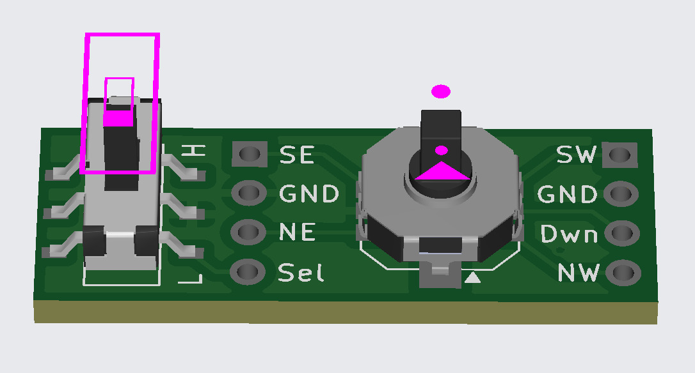
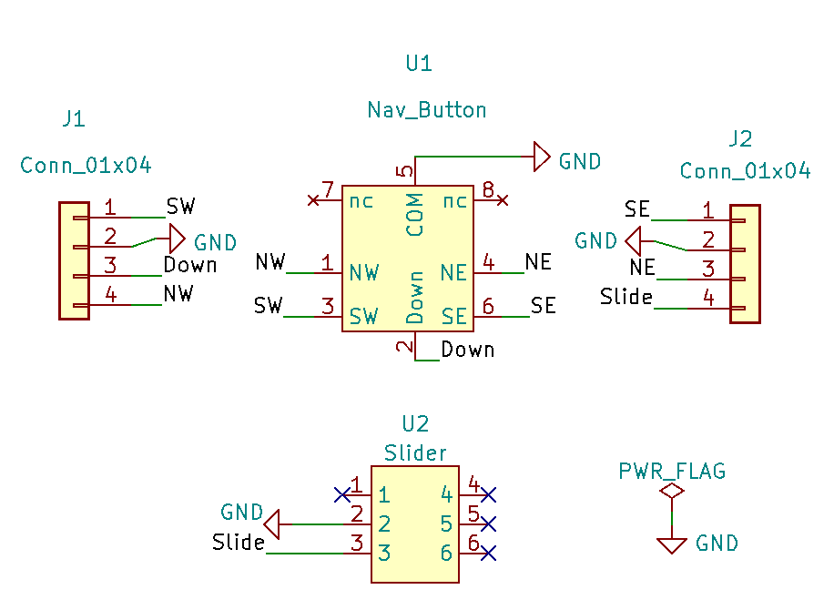
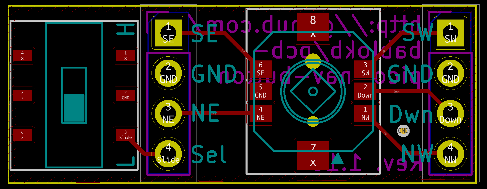
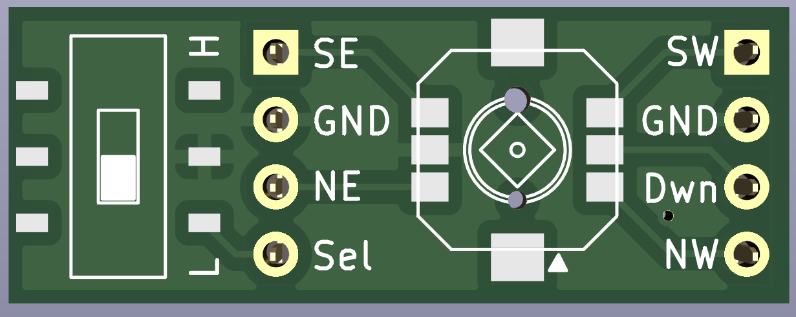
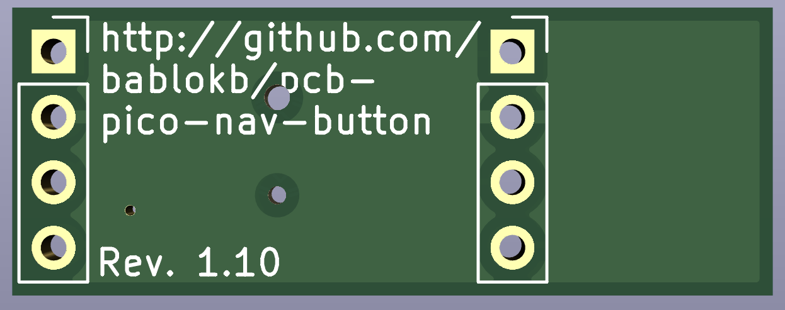

Slider and Navigation-Button PCB for the Raspberry Pi Pico
==========================================================

This is a little PCB for the Pico featuring a slider and a 5-way navigational button.

The PCB uses 6 GPIOs: one for the slider, five for the navigational button:

    P1 (SE)        P2  (SW)
    GND            GND
    P3 (NE)        P4  (Down)
    P5 (Slider)    P6  (NW)

There are four options for mounting the PCB on the back of the Pico
(viewing from the back, the high GP-numbers are on the left):

  - GP28-GP26 / GP5-GP7
  - GP22-GP20 / GP12-GP15
  - GP19-GP17 / GP12-GP14 (rotated!)
  - GP18-GP16 / GP13-GP15

KiCAD (V6) files are available in the directory `pico-nav-button`. Ready to use
production files for JLCPCB are in the directory `production_files`.

Schematic and Layout
--------------------

3D-View
-------

License
-------

[![CC BY-SA 4.0][cc-by-sa-shield]][cc-by-sa]

This work is licensed under a
[Creative Commons Attribution-ShareAlike 4.0 International
License][cc-by-sa].

[![CC BY-SA 4.0][cc-by-sa-image]][cc-by-sa]

[cc-by-sa]: http://creativecommons.org/licenses/by-sa/4.0/
[cc-by-sa-image]: https://licensebuttons.net/l/by-sa/4.0/88x31.png
[cc-by-sa-shield]:
https://img.shields.io/badge/License-CC%20BY--SA%204.0-lightgrey.svg
